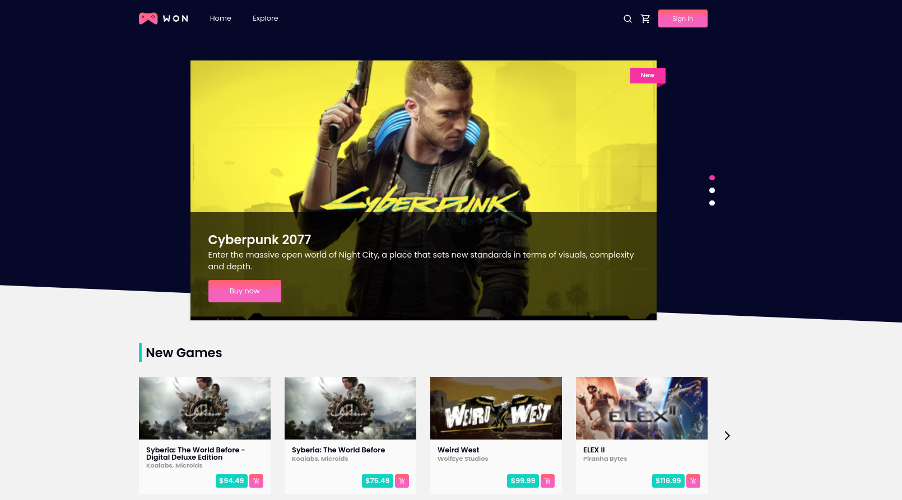
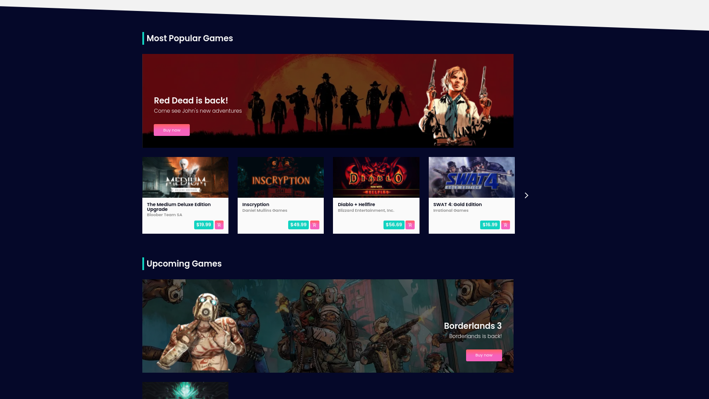
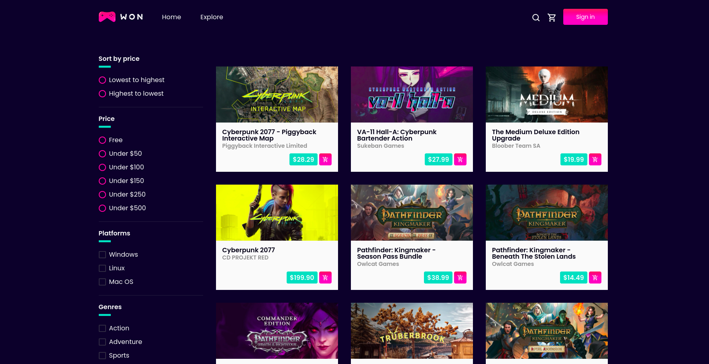
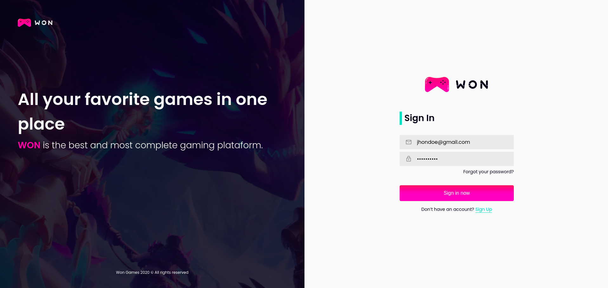
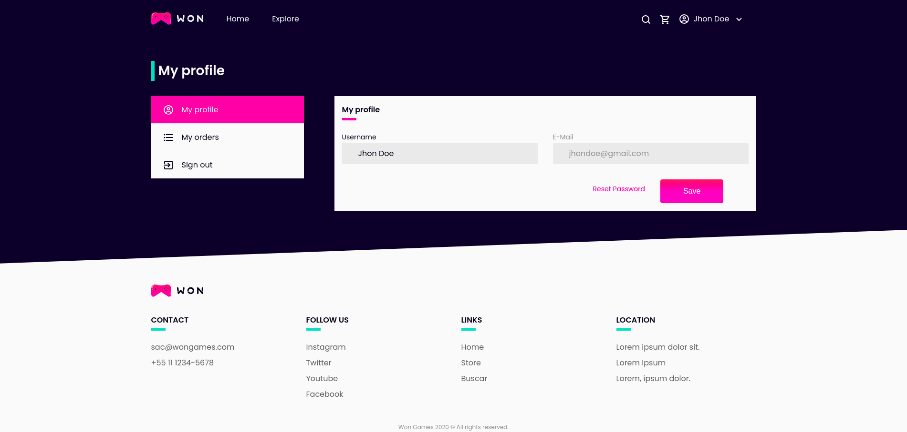
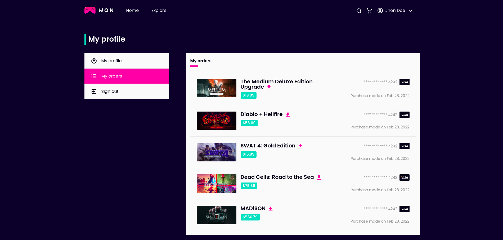
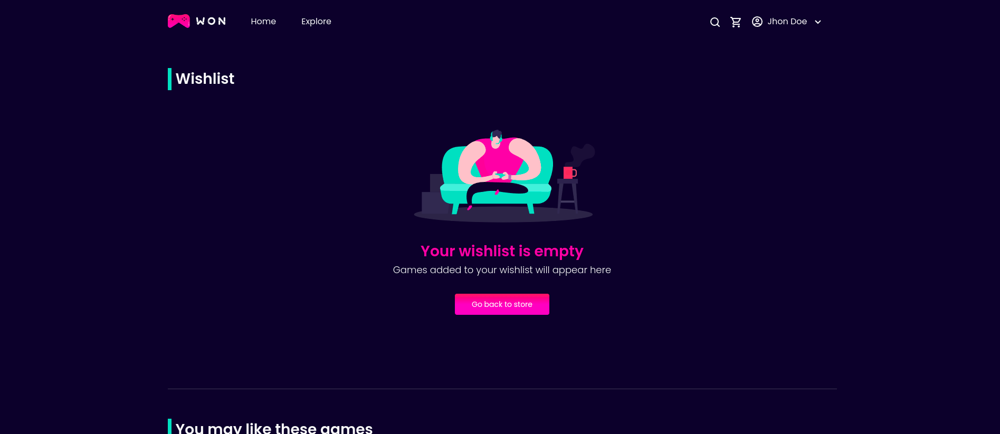

<h2 align="center">
  Won Games
</h2>

<p align="center">
  
</p>

<p align="center">
  

  

  

  

  

  
</p>

<br>

### :writing_hand: About this project
This is the repository of the front-end of the Won Games platform, Won Games is an online game marketplace, where you can buy and download your games, its development was with Javascript/TypeScript, React/NextJS, Apollo/GraphQL, Jest/React-testing-library, Cypress and Storybook technologies.

### :cyclone: How to run this project
> **IMPORTANT**: To run this project you need to have the database and the API of the project running, for that we have the database repository and the API repository, in each of them you can download on your machine and follow the instructions on how to leave them running.

[REPOSITORY DATABASE](https://github.com/jefferson1104/wonGames-database)
[REPOSITORY API](https://github.com/jefferson1104/wonGames-api)


```bash
# Clone this repository
$ git clone https://github.com/jefferson1104/wonGames-client

# Access the project folder
$ cd wonGames-client

# Run project
$ yarn dev

# Run storybook
$ yarn storybook

# Run jest and react-testing-lirary tests
$ yarn test

# Run tests end to end
$ yarn cy:run
```
### 🎨 Screenshots
<p align="center">
  
  
  
  
  
  
  
</p>
